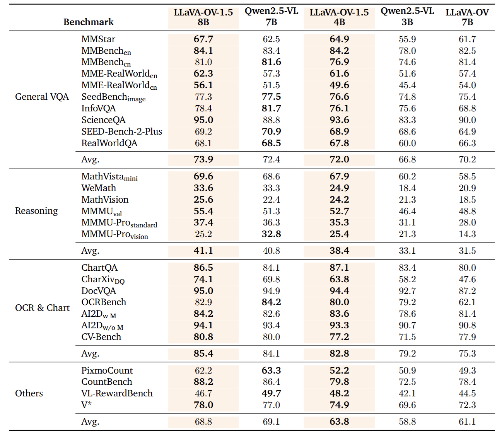

<p align="center">
  <picture>
    <source media="(prefers-color-scheme: dark)" srcset="asset/llava_onevision_black.png">
    <source media="(prefers-color-scheme: light)" srcset="asset/llava_onevision_white.png">
    
  </picture>
</p>

<p align="center">
  <strong>Fully Open Framework for Democratized Multimodal Training</strong>
</p>

<div align="center">

🤗 **[Models and Datasets](https://huggingface.co/collections/lmms-lab/llava-onevision-15-68d385fe73b50bd22de23713)** |
🖥️ **[Demo](https://huggingface.co/spaces/lmms-lab/LLaVA-OneVision-1.5)** |
📄 **[Tech Report](https://arxiv.org/abs/2509.23661)**

</div>


<p align="center">
  <!-- Mid-Training Dataset Downloads -->
  <a href="https://huggingface.co/datasets/lmms-lab/LLaVA-One-Vision-1.5-Mid-Training-85M">
    
  </a>
  <!-- Instruct Dataset Downloads -->
  <a href="https://huggingface.co/datasets/lmms-lab/LLaVA-OneVision-1.5-Insturct-Data">
    
  </a>
  <!-- Model Downloads -->
  <a href="https://huggingface.co/lmms-lab/LLaVA-OneVision-1.5-8B-Instruct">
    
  </a>
  <!-- Training Cost -->
  
  <!-- License -->
  <a href="LICENSE">
    
  </a>
  <!-- PRs Welcome -->
  <a href="https://github.com/EvolvingLMMs-Lab/LLaVA-OneVision-1.5/pulls">
    
  </a>
  <!-- Commit Activity -->
  <a href="https://github.com/EvolvingLMMs-Lab/LLaVA-OneVision-1.5/commits">
    
  </a>
  <!-- Contributors -->
  <a href="https://github.com/EvolvingLMMs-Lab/LLaVA-OneVision-1.5/graphs/contributors">
    
  </a>
  <!-- Megatron-LM Optimization -->
  <a href="https://github.com/NVIDIA/Megatron-LM">
    
  </a>
  <!-- ModelScope Collection -->
  <a href="https://www.modelscope.cn/collections/LLaVA-OneVision-15-ff6ede3d20a643" target="_blank">
    
  </a>
</p>

---


## Contents
<!-- TOC (no expansion for Quick Start Guide / Fully Reproducing Guide) -->
- [Introduction](#introduction)
- [Models](#models)
- [Datasets](#datasets)
- [Results](#evaluation-results)
- [Quick Start with HuggingFace](#quick-start-with-huggingface)
- [Evaluation](#evaluation)
- [Quick Start For Training](#quick-start-guide)
- [Fully Reproducing Guide](#fully-reproducing-guide)
- [Citation](#citation)
- [Acknowledgement](#acknowledgement)


## Introduction
**LLaVA-OneVision1.5** introduces a novel family of **fully open-source** Large Multimodal Models (LMMs) that achieves **state-of-the-art performance**  with substantially **lower cost** through training on **native resolution** images.

- **Superior Performance**
A family of fully open-source large multimodal models demonstrating 
    - Superior performance across multiple multimodal benchmarks
    - outperforming **Qwen2.5-VL** in most evaluation tasks.

- **High-Quality Data at Scale**
Meticulously curated **pre-training and SFT data** with rigorous filtering and quality control.
    - Concept-balanced, highly diverse, high-quality caption data
    - Comprehensive instruction fine-tuning data covering a wide range of tasks

- **Ultra-Efficient Training Framework** Complete end-to-end training framework designed for maximum efficiency:
    - $16000 total budget for full model training on A100 GPUs  ($0.6 per GPU/Hour)
    - Built on **MegatronLM** with support for **MoE**, **FP8**, and **long sequence parallelization**
    - Optimized codebase for cost-effective scaling


- **Fully Open Framework** for community access and reproducibility:
    - High-quality pre-training & SFT data
    - Complete training framework & code
    - Training recipes & configurations
    - Comprehensive training logs & metrics


## Models

| Model                    | HF Link                                                                                      | Training Log |
|--------------------------|--------------------------------------------------------------------------------------------------------|-------------|
| LLaVA-OV-1.5-4B-Instruct | [🤗 HF / 4B-Instruct](https://huggingface.co/lmms-lab/LLaVA-OneVision-1.5-4B-Instruct)                | [📈 Tensorboard](https://huggingface.co/lmms-lab/LLaVA-OneVision-1.5-4B-Instruct/tensorboard) |
| LLaVA-OV-1.5-8B-Instruct | [🤗 HF / 8B-Instruct](https://huggingface.co/lmms-lab/LLaVA-OneVision-1.5-8B-Instruct)                | [📈 Tensorboard](https://huggingface.co/lmms-lab/LLaVA-OneVision-1.5-8B-Instruct/tensorboard) |
| LLaVA-OV-1.5-4B-Base     | [🤗 HF / 4B-Base](https://huggingface.co/lmms-lab/LLaVA-OneVision-1.5-4B-Base)                | Uploading… |
| LLaVA-OV-1.5-8B-Base     | [🤗 HF / 8B-Base](https://huggingface.co/lmms-lab/LLaVA-OneVision-1.5-8B-Base)                | Uploading… |
## Datasets


<p align="left">
  <strong>(a)</strong> The vocabulary coverage proportion in the LLaVA-OneVision-1.5 Mid-Training dataset before and after concept balancing.
  <strong>(b)</strong> Distribution of data sources within the LLaVA-OneVision-1.5 Mid-Training dataset.
  <strong>(c)</strong> Distribution of data sources within the LLaVA-OneVision-1.5 Insturct dataset.
</p>

| Description        | Link                                                                                                   | Status      |
|--------------------|--------------------------------------------------------------------------------------------------------|-------------|
| LLaVA-OV-1.5-Mid-Training-85M   | [🤗HF / Mid-Training 85M](https://huggingface.co/datasets/lmms-lab/LLaVA-One-Vision-1.5-Mid-Training-85M) | Uploading…  |
| LLaVA-OV-1.5-Instruct           | [🤗HF / Insturct-Data](https://huggingface.co/datasets/lmms-lab/LLaVA-OneVision-1.5-Insturct-Data)        | Uploading…  |


## Evaluation Results


All evaluations were conducted using lmms_eval.




## Quick Start with HuggingFace

```python
from transformers import AutoTokenizer, AutoProcessor, AutoModelForCausalLM
from qwen_vl_utils import process_vision_info
model_path = "lmms-lab/LLaVA-One-Vision-1.5-8B-Instruct"

# default: Load the model on the available device(s)
model = AutoModelForCausalLM.from_pretrained(
    model_path, torch_dtype="auto", device_map="auto", trust_remote_code=True
)

# default processer
processor = AutoProcessor.from_pretrained(model_path, trust_remote_code=True)

messages = [
    {
        "role": "user",
        "content": [
            {
                "type": "image",
                "image": "https://qianwen-res.oss-cn-beijing.aliyuncs.com/Qwen-VL/assets/demo.jpeg",
            },
            {"type": "text", "text": "Describe this image."},
        ],
    }
]

# Preparation for inference
text = processor.apply_chat_template(
    messages, tokenize=False, add_generation_prompt=True
)
image_inputs, video_inputs = process_vision_info(messages)
inputs = processor(
    text=[text],
    images=image_inputs,
    videos=video_inputs,
    padding=True,
    return_tensors="pt",
)
inputs = inputs.to("cuda")

# Inference: Generation of the output
generated_ids = model.generate(**inputs, max_new_tokens=1024)
generated_ids_trimmed = [
    out_ids[len(in_ids) :] for in_ids, out_ids in zip(inputs.input_ids, generated_ids)
]
output_text = processor.batch_decode(
    generated_ids_trimmed, skip_special_tokens=True, clean_up_tokenization_spaces=False
)
print(output_text)

```

## Evaluation
```
# pip install git+https://github.com/EvolvingLMMs-Lab/lmms-eval.git  

accelerate launch --num_processes=8 --main_process_port 12399 -m lmms_eval \
    --model=llava_onevision1_5 \
    --model_args=pretrained=lmms-lab/LLaVA-OneVision-1.5-8B-Instruct,attn_implementation=flash_attention_2,max_pixels=3240000 \
    --tasks=mmmu_val,mmmu_pro_standard,mmbench_en_test,mmerealworld,mmerealworld_cn,ai2d,ai2d_no_mask,vstar_bench,chartqa,charxiv,docvqa_test,mathvista_testmini,mmstar,scienceqa \
    --batch_size=1
```


## Quick Start Guide

### 1.🐳 Docker (Recommended)

We strongly recommend using the docker environment for a seamless experience. The following instructions are tailored for the A100 80GB GPU environment.


```bash
# Clone repository
git clone https://github.com/EvolvingLMMs-Lab/LLaVA-OneVision-1.5.git
cd LLaVA-OneVision-1.5

docker build -t llava_megatron:25.04 .

# Run container with -w to set working directory directly to the mounted volume
docker run -it --gpus all \
    --ipc host --net host --privileged --cap-add IPC_LOCK \
    --ulimit memlock=-1 --ulimit stack=67108864 --rm \
    -v $(pwd):/workspace/LLaVA-OneVision-1.5 \
    -w /workspace/LLaVA-OneVision-1.5 \
    --name "llava_megatron_container" \
    llava_megatron:25.04 /bin/bash
```

### 2. Checkpoint and Format Conversion

You have two options to get started with LLaVA-OneVision-1.5-stage-0:

#### Option 1: Download pre-trained model from HuggingFace
Download our `LLaVA-OneVision-1.5-4B-stage0` model directly from [HuggingFace](https://huggingface.co/lmms-lab/LLaVA-OneVision-1.5-4B-stage0).

#### Option 2: Merge initial weights yourself
Alternatively, you can merge the initial weights from the original ViT and LLM:
```bash
python ds/merge_model.py \
--vit_path DeepGlint-AI/rice-vit-large-patch14-560 \
--llm_path Qwen/Qwen3-4B-Instruct-2507 \
--output LLaVA-OneVision-1.5-4B-stage0
```
Note: When merging weights, the adapter component will be initialized with default values.

Convert the model from HuggingFace format to Megatron format:

```bash
AIAK_TRAINING_PATH=/workspace/LLaVA-OneVision-1.5 bash examples/llava_ov_1_5/convert/convert_4b_hf_to_mcore.sh \
LLaVA-OneVision-1.5-4B-stage0 \
LLaVA-OneVision-1.5-4B-stage0_mcore_tp1_pp1 \
1 1
```

### 3. Stage 1 Alignment-Training

Download LLaVA from [LLaVA-558K-Webdataset](https://huggingface.co/datasets/lmms-lab/LLaVA-558K-Webdataset).


```bash
# ============================================================
# Required environment variables:
#   AIAK_TRAINING_PATH  Root directory of the AIAK-Training-LLM project
#   DATA_PATH           Directory with WebDataset shards (.tar) for pretraining
#   TOKENIZER_PATH      Hugging Face tokenizer directory
#   CHECKPOINT_PATH     Megatron-formatted checkpoint directory (e.g., mcore TP1/PP1)
#   SAVE_CKPT_PATH      Output directory for saving training checkpoints
AIAK_TRAINING_PATH=/workspace/LLaVA-OneVision-1.5 \
DATA_PATH=LLaVA-558K-Webdataset \
TOKENIZER_PATH=LLaVA-OneVision-1.5-4B-stage0 \
CHECKPOINT_PATH=LLaVA-OneVision-1.5-4B-stage0_mcore_tp1_pp1 \
bash examples/llava_ov_1_5/quick_start/stage_1_alignment_llava_ov_4b.sh
```

### 4. Stage 1.5 Mid-Training 

Download our lightweight packed subset from [LLaVA-OneVision-1.5-Mid-Training-Quick-Start-3M-Webdataset](https://huggingface.co/datasets/lmms-lab/LLaVA-OneVision-1.5-Mid-Training-Webdataset-Quick-Start-3M).

```bash
# ============================================================
# Convert model to release format
bash examples/llava_ov_1_5/convert/convert_4b_mcore_to_release.sh \
stage_1_alignment_llava_ov_4b/iter_0002500/ \
stage_1_alignment_llava_ov_4b_release 1 1
# ============================================================
# Launch
AIAK_TRAINING_PATH=/workspace/LLaVA-OneVision-1.5 \
DATA_PATH=LLaVA-OneVision-1.5-Mid-Training-Quick-Start-3M-Webdataset \
TOKENIZER_PATH=LLaVA-OneVision-1.5-4B-stage0 \
CHECKPOINT_PATH=stage_1_alignment_llava_ov_4b_release \
bash examples/llava_ov_1_5/quick_start/stage_1.5_mid_training_llava_ov_4b.sh
```


### 5. Stage 2 Instruct-Training

Download LLaVA-NeXT-780k-webdataset at [LLaVA-NeXT-780K Dataset](https://huggingface.co/datasets/lmms-lab/LLaVA-NeXT-780k-webdataset).

```bash
# ============================================================
# Convert model to release format
bash examples/llava_ov_1_5/convert/convert_4b_mcore_to_release.sh \
stage_1.5_mid_training_llava_ov_4b/iter_0020000/ \
stage_1.5_mid_training_llava_ov_4b_release 1 1
# ============================================================
# # Launch
AIAK_TRAINING_PATH=/workspace/LLaVA-OneVision-1.5 \
DATA_PATH=LLaVA-NeXT-780k-Webdataset \
TOKENIZER_PATH=LLaVA-OneVision-1.5-4B-stage0 \
CHECKPOINT_PATH=stage_1.5_mid_training_llava_ov_4b_release \
bash examples/llava_ov_1_5/quick_start/stage_2_instruct_llava_ov_4b.sh
```


### 6. Convert mcore to huggingface
```bash
AIAK_TRAINING_PATH=/workspace/LLaVA-OneVision-1.5 \
bash examples/llava_ov_1_5/convert/convert_4b_mcore_to_hf.sh \
stage_2_instruct_llava_ov_4b/iter_0003500 \
LLaVA-OneVision-1.5-4B-3M-Mid-Training-780K-Instruct \
1 1
# Copy non-model files (e.g., tokenizer config) to the new directory
find LLaVA-OneVision-1.5-4B-stage0/ -type f -not -iname '*safetensors*' -exec cp {}  LLaVA-OneVision-1.5-4B-3M-Mid-Training-780K-Instruct/ ';'
```

### 7. Evaluation
```bash
# pip install git+https://github.com/EvolvingLMMs-Lab/lmms-eval.git
CUDA_VISIBLE_DEVICES=4,5,6,7 accelerate launch \
--num_processes=4 --main_process_port 12399 -m lmms_eval --model=llava_onevision1_5 --batch_size=1 --tasks=mme \
--model_args=pretrained=/workspace/LLaVA-OneVision-1.5/LLaVA-OneVision-1.5-4B-3M-Mid-Training-780K-Instruct,max_pixels=3240000
```

## Fully Reproducing Guide

> [!TIP]
> More detailed reproduction steps for the complete process will be provided after the dataset upload is completed.


### Mid-Training

To improve model training efficiency, we implement offline sample packing:

1. Download the [**Mid-Training-85M Dataset**](https://huggingface.co/datasets/lmms-lab/LLaVA-One-Vision-1.5-Mid-Training-85M)
2. Pack the data into webdataset format, refer to [**Offline Padding-Free Data Packing**](examples/llava_ov_1_5/sample_packing/README.md)


### Instruct
1. Download the [**LLaVA-OneVision-1.5-Insturct-Data**](https://huggingface.co/datasets/lmms-lab/LLaVA-OneVision-1.5-Insturct-Data)
2. Convert the data into webdataset format, refer to [**Conversion for Mixed Instruction Data**](docs/sft_data_preprocessing.md)

## Roadmaps

Q4 2025 Key Deliverables:

1. **Ultra-efficient MoE Training**  
2. **Full Video Input LLM**  


## Contributors
Thanks so much to all of our amazing contributors!

<!-- readme: collaborators,contributors,jiankangdeng/- -start -->
<table>
	<tbody>
		<tr>
            <td align="center">
                <a href="https://github.com/anxiangsir">
                    
                    <br />
                    <sub><b>anxiangsir</b></sub>
                </a>
            </td>
            <td align="center">
                <a href="https://github.com/yiyexy">
                    
                    <br />
                    <sub><b>yiyexy</b></sub>
                </a>
            </td>
            <td align="center">
                <a href="https://github.com/wideyard">
                    
                    <br />
                    <sub><b>wideyard</b></sub>
                </a>
            </td>
            <td align="center">
                <a href="https://github.com/chengzheng345">
                    
                    <br />
                    <sub><b>chengzheng345</b></sub>
                </a>
            </td>
            <td align="center">
                <a href="https://github.com/mathCrazyy">
                    
                    <br />
                    <sub><b>mathCrazyy</b></sub>
                </a>
            </td>
            <td align="center">
                <a href="https://github.com/yunglechao">
                    
                    <br />
                    <sub><b>yunglechao</b></sub>
                </a>
            </td>
            <td align="center">
                <a href="https://github.com/RobitYadda">
                    
                    <br />
                    <sub><b>RobitYadda</b></sub>
                </a>
            </td>
		</tr>
	<tbody>
</table>
<!-- readme: collaborators,contributors,jiankangdeng/- -end -->

## Citation

If you find *LLaVA-OneVision-1.5* useful in your research, please consider to cite the following related papers:

```
@inproceedings{LLaVA-OneVision-1.5,
  title={LLaVA-OneVision-1.5: Fully Open Framework for Democratized Multimodal Training},
  author={An, Xiang and Xie, Yin and Yang, Kaicheng and Zhang, Wenkang and Zhao, Xiuwei and Cheng, Zheng and Wang, Yirui and Xu, Songcen and Chen, Changrui and Wu, Chunsheng and Tan, Huajie and Li, Chunyuan and Yang, Jing and Yu, Jie and Wang, Xiyao and Qin, Bin and Wang, Yumeng and Yan, Zizhen and Feng, Ziyong and Liu, Ziwei and Li, Bo and Deng, Jiankang},
  booktitle={arxiv},  
  year={2025}
 }

@inproceedings{xie2025region,
  title={Region-based Cluster Discrimination for Visual Representation Learning},
  author={Xie, Yin and Yang, Kaicheng and An, Xiang and Wu, Kun and Zhao, Yongle and Deng, Weimo and Ran, Zimin and Wang, Yumeng and Feng, Ziyong and Miles, Roy and Elezi, Ismail and Deng, Jiankang},
  booktitle={ICCV},
  year={2025}
}

@article{lillava,
  title={LLaVA-OneVision: Easy Visual Task Transfer},
  author={Li, Bo and Zhang, Yuanhan and Guo, Dong and Zhang, Renrui and Li, Feng and Zhang, Hao and Zhang, Kaichen and Zhang, Peiyuan and Li, Yanwei and Liu, Ziwei and Li, Chunyuan},
  journal={Transactions on Machine Learning Research}
  year={2024}
}
```

## Acknowledgement

We extend our sincere gratitude to **AIAK team of the** [**Baige AI computing platform**](https://cloud.baidu.com/product/aihc.html) **from Baidu AI Cloud** for providing the exceptional training framework. The outstanding capabilities of AIAK-Training-LLM and AIAK-Megatron have significantly accelerated our training process with remarkable efficiency. These cutting-edge frameworks have been instrumental in achieving our research goals. `To get full AIAK support, you can contact Baidu Cloud.`


We also thank the maintainers and contributors of the following open-source projects, whose work greatly inspired and supported our research:

- LLaVA: Large Language-and-Vision Assistant — [LLaVA](https://github.com/haotian-liu/LLaVA)
- LLaVA-NeXT: Next-generation multi-modal assistant — [LLaVA-NeXT](https://github.com/LLaVA-VL/LLaVA-NeXT)
- lmms-eval: A standardized evaluation framework for Large Multimodal Models — [lmms-eval](https://github.com/EvolvingLMMs-Lab/lmms-eval)
- Megatron-LM: Efficient, scalable training for large language models — [Megatron-LM](https://github.com/NVIDIA/Megatron-LM)
- Qwen2.5-VL: Strong vision-language foundation model — [Qwen2.5-VL](https://github.com/QwenLM/Qwen2.5-VL)
- InternVL: Open-source large-scale vision-language foundation model — [InternVL](https://github.com/OpenGVLab/InternVL)
- Qwen3: Next-generation Qwen LLM — [Qwen](https://github.com/QwenLM/Qwen)
- MetaCLIP: Scalable contrastive pretraining — [MetaCLIP](https://github.com/facebookresearch/MetaCLIP)
- FineVision: Open Data Is All You Need — [FineVision](https://huggingface.co/spaces/HuggingFaceM4/FineVision)
